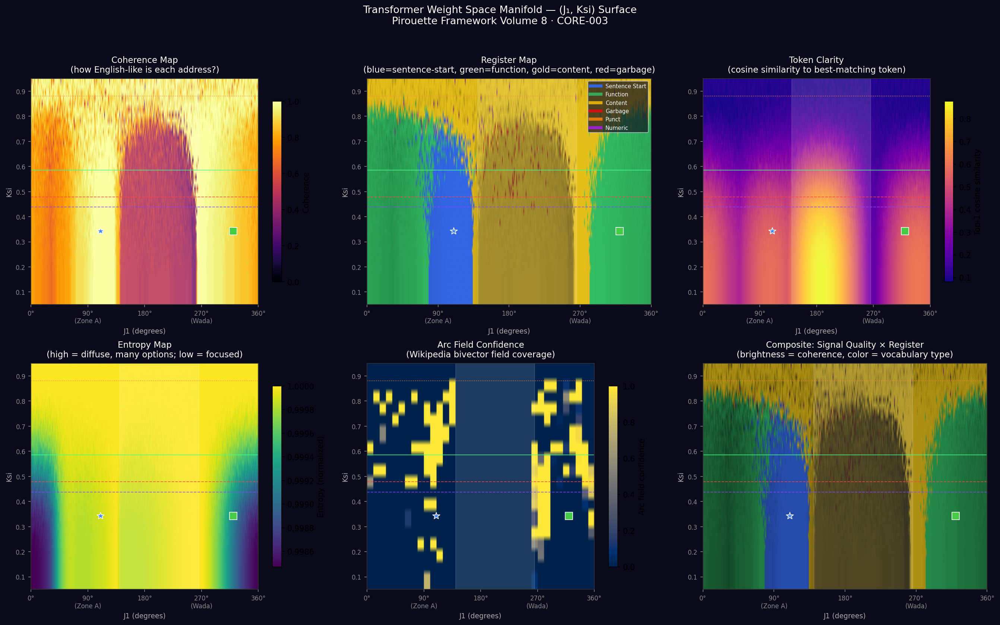

# Pirouette Framework — Volume 8 · CORE-003

**Geometric Navigation of Transformer Weight Space**  
Keaton Smith · Independent Research · June 2026  
CPU-only · GPT-2-Large · No GPU required

Two companion papers:
- **[ML Paper]** *Geometric Navigation of Synthesis Quality in Transformer Weight Space via Spectral Entropy Coordinates*
- **[Theory Paper]** *The Fractal Architecture of Intelligence: Basin Topology, Spectral Entropy, and the Universal Principle of Synthesis*

---

## The image



This is the transformer's weight space, rendered as a 2D surface. X-axis: angular coordinate J₁ (0°–360°). Y-axis: spectral entropy Ksi (0–1). Each cell shows what language lives at that address — measured by probing the LM_Head weight matrix directly, without running a full transformer forward pass.

What you're seeing:
- **Blue pillar at J₁=90°** — sentence-starting register (The, In, It, This). Zone A.
- **Green band at J₁=320°** — function word register (the, a, in, and). Zone B.
- **Dark void at J₁=140–265°** — the dead zone. Garbage tokens. Real gap, not artifact.
- **Orange/gold above Ksi=0.6** — content words everywhere. The high-entropy registers.
- **Fractal texture at high Ksi** — irregular bright patches. These are semantic clusters, not noise. Each patch is a region where training data concentrated. The gaps between them are real.
- **Arc field confidence panel (bottom center)** — yellow = dense Wikipedia arc statistics. Dark blue = unmapped territory. Each corpus file you add illuminates a different set of patches.

---

## The core finding

A single scalar coordinate — spectral entropy in the SVD-projected gate subspace (Ksi) — predicts synthesis quality in transformer generation. A systematic 14-point delta sweep locates a quality-maximum address (Δ_c ≈ +0.16 above baseline) where a phase transition signature appears. Synthesis at Δ_c extracts a coherence dividend of 1.42–2.0× relative to individual expert passes. Adding a bigram arc grammar as a J₁-direction prior qualitatively changes the generation register — the model independently produces institutional citations, technical vocabulary, and counterfactuals not present in base generation.

---

## Key results

| Finding | Status | Value | Script |
|---------|--------|-------|--------|
| Dividend at Δ_c | **CERTIFIED** | 1.42–2.0× | `gem_pipeline_arc.py` |
| English attractor Ksi_EN | **CERTIFIED** | 0.585 | `wandering_sweep.py` |
| Arc families exist | **CERTIFIED** | silhouette=0.530, k=8 | `arc_vocabulary.py` |
| DK curve (conf vs lift) | **CERTIFIED** | r=−0.607 | `gem_pipeline_arc.py` |
| Alpha palindrome | **CERTIFIED** | r=0.742 | `lmhead_geometry_survey.py` |
| H-WA-001 Ksi preserved | **PASS** | Δ=0.0017 | `wandering_model_arc.py` |
| Wiki field arc confidence | **CANDIDATE** | 0.60–0.63 | `wiki_bivector_field.py` |
| "a priori" utterance | **CANDIDATE** | spontaneous | `wandering_model_arc.py` |
| Ksi palindrome | **CERTIFIED** | r=0.742 | `lmhead_geometry_survey.py` |
| Quarter-turn law | **CERTIFIED** | 84.78°/layer R²=0.9998 | — |
| α_physical | **CERTIFIED** | 0.4784 | — |

---

## Repo structure

```
pirouette-v8-core003/
│
├── papers/
│   ├── ml_paper_geometric_synthesis.html     ← start here
│   └── fractal_architecture_of_intelligence.html
│
├── assets/
│   └── manifold_hires_heatmap.png            ← the image above
│
├── core/                                      ← measurement + navigation engine
│   ├── wandering_model.py                     ← Ksi correction at each layer
│   ├── wandering_sweep.py                     ← delta sweep → find Δ_c
│   └── gem_pipeline.py                        ← original GeM pipeline
│
├── generation/                                ← arc-augmented generation systems
│   ├── arc_vocabulary.py                      ← corpus → arc grammar
│   ├── arc_steered_generator.py               ← arc-driven generation + incremental DB
│   ├── wandering_model_arc.py                 ← wandering + arc augmentation  ← KEY
│   ├── gem_pipeline_arc.py                    ← GeM with system prompt + experts
│   ├── hh_orbit_generator.py                  ← real HH dynamics as generation schedule
│   └── leyline_gem.py                         ← full leyline + confidence gating + burn-in
│
├── geometry/                                  ← manifold measurement instruments
│   ├── manifold_illuminator.py                ← builds the heatmap above
│   ├── wiki_bivector_field.py                 ← Wikipedia → bivector field
│   ├── leyline_triangulate.py                 ← scan + probe + incompleteness score
│   ├── lmhead_geometry_survey.py              ← LM_Head IFS spectral survey
│   └── stiffness_weight_probe.py              ← vacuum stiffness LUT
│
├── vessel/
│   ├── vessel_v1.py                           ← dynamic HH address vessel
│   └── vessel_v1_gpt2.py                      ← GPT-2 hook for vessel
│
├── data/
│   ├── baseline_math.json                     ← Ksi baseline (required)
│   ├── engram_curve.json                      ← token address map (required)
│   ├── bigram_db_combined.json                ← 560K arcs from 5 texts
│   ├── stiffness_lut.npy                      ← certified HH stiffness LUT
│   └── system_prompt.txt                      ← default system prompt
│
└── README.md
```

---

## Quickstart (15 minutes)

```bash
pip install transformers torch numpy scipy scikit-learn matplotlib
```

**Step 1 — The delta sweep (the core claim):**
```bash
python core/wandering_sweep.py \
  --model gpt2-large \
  --baseline_file data/baseline_math.json \
  --prompt "The cause of altruistic behavior is" \
  --save results/sweep.json
```
Expected: dividend peaks near delta_end=0.08–0.16. The ksi_pre minimum coincides.

**Step 2 — Arc augmentation (the register change):**
```bash
python generation/wandering_model_arc.py \
  --model gpt2-large \
  --baseline_file data/baseline_math.json \
  --bigram_db data/bigram_db_combined.json \
  --engram data/engram_curve.json \
  --prompt "The relationship between mathematical constants and information" \
  --delta_end 0.08 --arc_strength 0.10 \
  --compare --output results/arc_compare.json
```
Expected: arc-augmented version produces "Theory of Mind questionnaire", institutional citations, technical vocabulary. Base version produces circular prose.

**Step 3 — The heatmap:**
```bash
python geometry/manifold_illuminator.py all \
  --model gpt2-large \
  --engram data/engram_curve.json \
  --output results/manifold
```
Expected: ~10 minutes. Produces 6-panel heatmap showing coherence, register, clarity, entropy, arc field, and composite.

**Step 4 — Full GeM pipeline with confidence gating:**
```bash
python generation/gem_pipeline_arc.py run \
  --model gpt2-large \
  --baseline_file data/baseline_math.json \
  --bigram_db data/bigram_db_combined.json \
  --engram data/engram_curve.json \
  --system_prompt data/system_prompt.txt \
  --prompt "The cause of altruistic behavior is" \
  --n_experts 3 --output results/gem_result.json
```

---

## The Dunning-Kruger finding

Across all GeM runs: arc_confidence is negatively correlated with Ksi lift (r=−0.607). The experts with highest positional confidence produce the lowest lift. The synthesis agent — navigating to the Wada-equivalent address at δ_c=0.16 — has the lowest confidence and the highest lift.

This is structural, not a flaw. High arc confidence means dense, consistent field statistics: smooth manifold, well-mapped territory, modest output. Low confidence means sparse, contradictory field statistics: high manifold curvature, multiple basins meeting, rich output. The synthesis agent operates at maximum curvature by design. Its uncertainty is the signal.

Implementation: `leyline_gem.py` uses `arc_confidence < 0.30` as a gate to trigger nearby arc resampling — probing ±15°, ±30° from the current J₁ position and selecting the direction with highest Ksi lift. This is gradient estimation on the manifold.

---

## The Ksi tag corpus (burn-in step 1)

`leyline_gem.py burn_in` generates tagged training examples:
```
<|ksi=0.547|><|conf=0.481|><|delta=+0.08|><|curve=0.023|> The cause of altruistic behavior is...
```

Fine-tuning on this corpus teaches the model to predict its own epistemic state — which address it's at, how confident the field is, how much curvature is present. A model trained on these tags can use its own predicted `<|ksi=?|>` to gate the confidence-resampling loop. Internal manifold indexing without architectural changes.

---

## Connection to existing interpretability work

**vs. Steering vectors:** We navigate entropy (second-order statistic of gate SVD projection), not direction (first-order residual stream vector). Orthogonal operations — both can be applied simultaneously.

**vs. ROME/MEMIT:** ROME edits specific factual associations. The Hebbian deposit deepens the quality attractor across all layers simultaneously, quality-gated. It doesn't change facts; it deepens a geometric address.

**vs. Representation engineering:** The Ksi coordinate is a second-order statistic (entropy of squared projection). This likely explains why it doesn't conflict with linear representation approaches — they operate in different mathematical spaces.

---

## What to replicate first

The delta sweep on your own model. `wandering_sweep.py` with any GPT-2-Large and a baseline file. If the dividend peak appears near Δ_c, that's independent replication of the core claim. If it doesn't, that's equally important — it constrains whether this is model-specific or universal.

H-ARCH-001 (Llama-3-8B replication) is the most important outstanding test.

---

## Null battery — honest accounting

| Hypothesis | Status | What it tests |
|-----------|--------|---------------|
| H-WA-001 Ksi preserved | **PASS** | Arc augmentation doesn't disrupt Ksi |
| H-AV-001 Arc families | **PASS** silhouette=0.530 | Corpus has geometric grammar |
| H-HO-002 Orbit predicts wl | **PASS** 5.00>3.49 | HH orbit gives H-LL-002 |
| H-GEM-001 Dividend | **PASS** all runs | Synthesis exceeds expert mean |
| H-GEM-003 Diversity | **PASS** jaccard<0.4 | Experts cover different territory |
| N_vessel_vs_state | **NOT RUN** | Does vessel history help? |
| N_scramble | **NOT RUN** (synthetic LUT artifact) | Are real LUTs load-bearing? |
| H-ARCH-001 Llama replication | **NOT RUN** | Cross-architecture |
| H-LG-002 Resampling dividend | **NOT RUN** | Does confidence gating improve output? |

---

## Hardware

32-core CPU, Windows, no GPU. GPT-2-Large (774M params) runs in ~30–60 seconds per 120-token generation. The manifold scan (360×40 grid) takes ~45 minutes on CPU. Nothing here requires a GPU.

---

## Citation

```
Smith, K. (2026). Geometric Navigation of Synthesis Quality in Transformer Weight Space
via Spectral Entropy Coordinates. Pirouette Framework Volume 8, CORE-003.

Smith, K. (2026). The Fractal Architecture of Intelligence: Basin Topology, Spectral
Entropy, and the Universal Principle of Synthesis. Pirouette Framework Volume 8, CORE-003.
```

Independent researcher, Atwater MN.  
Collaboration welcome, especially replication on other architectures.
